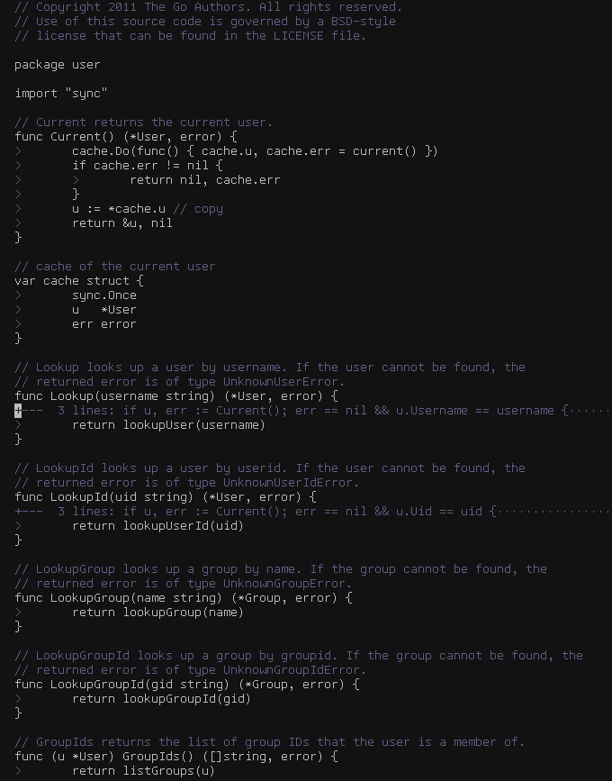

# Beelzebub
Easy for eyes and mind minimal three-colors colorscheme.



## Installation

With VimPlug:

```bash
Plug 'xdefrag/vim-beelzebub'
```

Or just throw beelzebub.vim in your colors directory.

## Usage

```vim
set background=dark
colorscheme beelzebub
```

## Settings
```vim
" You can adjust colors you want like this:
let g:beelzebub_bg="233"
let g:beelzebub_fg="250"
let g:beelzebub_mute="60"

" Add color noises for syntax highlightning:
let g:beelzebub_syntax_mute=1

" And make parts of it bold:
let g:beelzebub_syntax_bold=1

" Then set light variant of colorscheme
set background=light
colorscheme beelzebub

" And ask yourself: "What have I done?!"
```

## Inspired by
...a bunch of great emacs monochrome themes, [nofrils](https://github.com/robertmeta/nofrils) and :SYNTAX OFF discussions on the internet.

